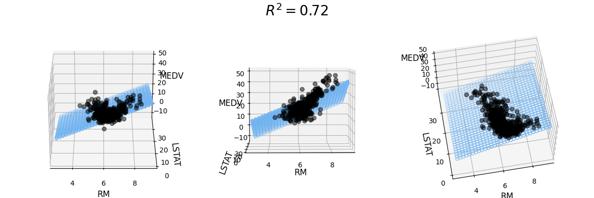
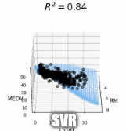

# Linear Regression Implementation
The dataset used is scikit-learns pre-built dataset on sklearn.dataset class called Boston Housing Dataset. 

Some ML preprocessing used here are:
1. Feature Engineering - Visualizing a seaborn Heatmap.
   
2. Feature Importance - Plotting the `coef_` Attribute of a Linear Regression.
   
3. Feature Scaling - Scaled all the values equally.
4. 3D Model Visualization - Visualize the actual model.
   - Linear Regression
     
   - Polynomial Linear Regression
     
   - Support Vector Regression
    
     
   
Here is the 3D Model of all 3 models:

You can view the notebook [here](https://nbviewer.jupyter.org/github/PrynsTag/Machine-Learning-Journey/blob/master/01%20-%20Linear%20Regression/Linear%20Regression%20Exercise.ipynb) in your browser.